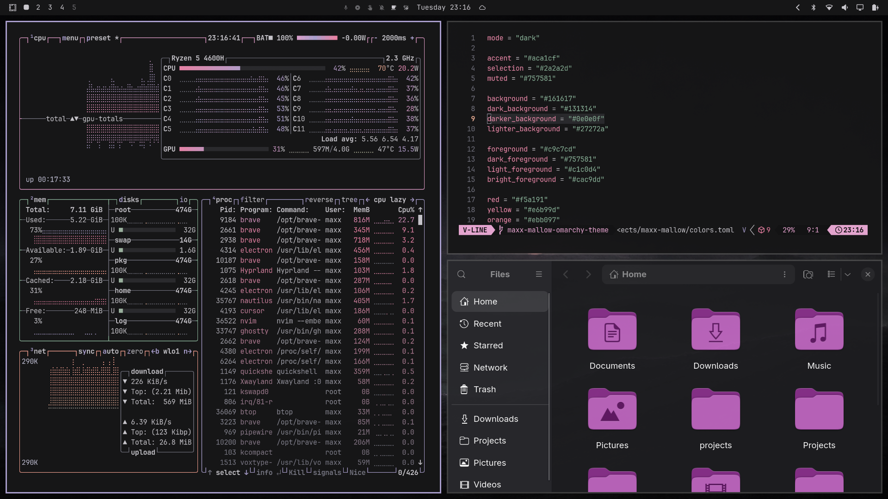
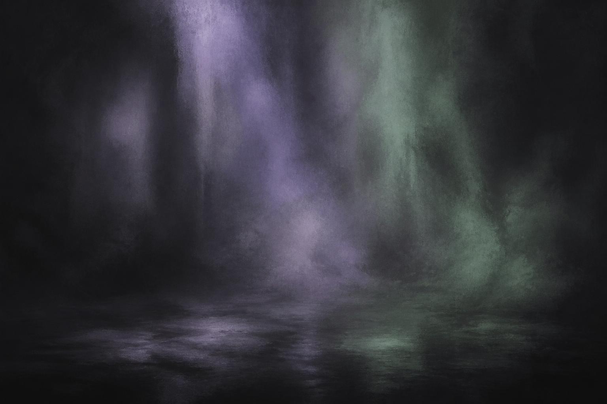
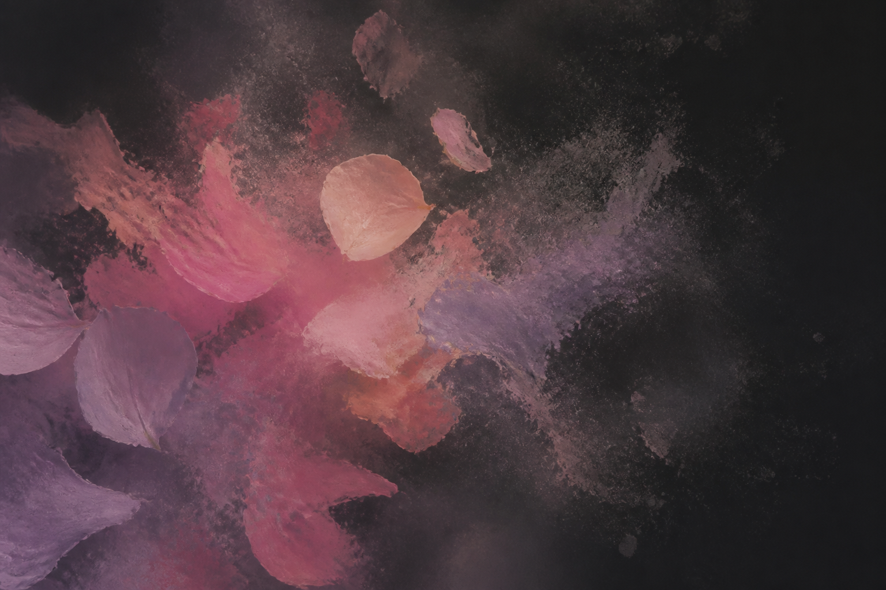

# Maxx Mellow for Omarchy

A dark Omarchy theme based on [mellow.nvim](https://github.com/mellow-theme/mellow.nvim): charcoal surfaces, dusty lavender, muted sage, peach, and rose (mellow’s cyan).



## Wallpapers

### Dusk



### Rose



### Mist


## Install

```bash
omarchy theme install https://github.com/maxxkph/omarchy-maxx-mellow-theme.git
```

Omarchy strips the `omarchy-` prefix and `-theme` suffix, so the theme slug is `maxx-mellow`.

## Manual installation

```bash
git clone https://github.com/maxxkph/omarchy-maxx-mellow-theme.git \
  ~/.config/omarchy/themes/maxx-mellow
omarchy theme set maxx-mellow
```

For local development, symlink the clone:

```bash
ln -sfn ~/Projects/omarchy-maxx-mellow-theme ~/.config/omarchy/themes/maxx-mellow
omarchy theme set maxx-mellow
```

## Palette

- Background: `#161617`
- Foreground: `#c9c7cd`
- Accent lavender: `#aca1cf`
- Green: `#90b99f`
- Rose (cyan): `#ea83a5`
- Magenta: `#e29eca`
- Peach red: `#f5a191`

Colors follow mellow.nvim’s dark palette (MIT). Omarchy builds terminals, Hyprland, Neovim, and related apps from `colors.toml`.

## Author

Created by maxx.

## License

MIT — see [LICENSE](LICENSE).
